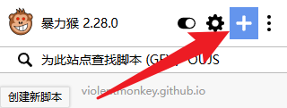
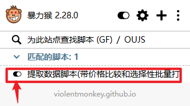
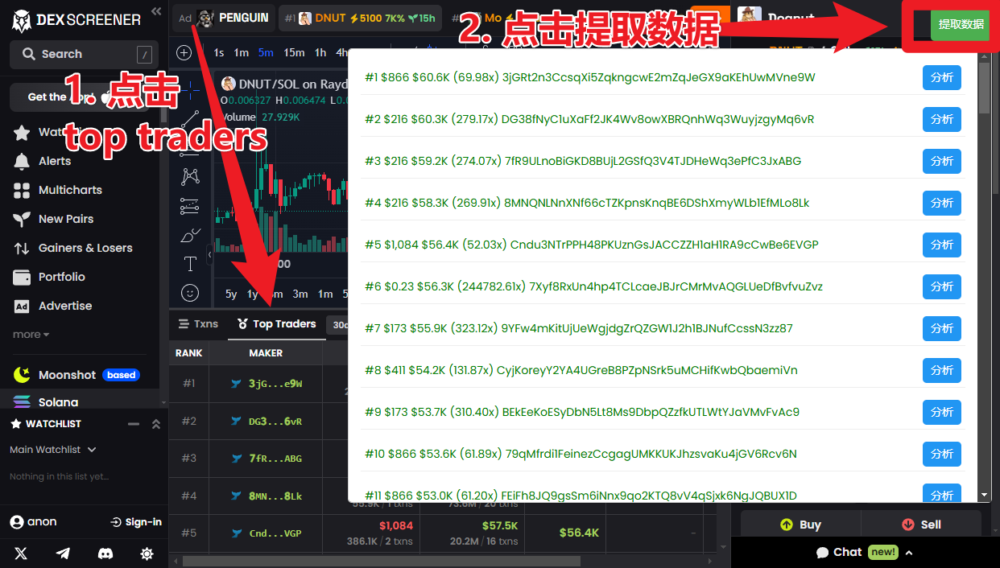
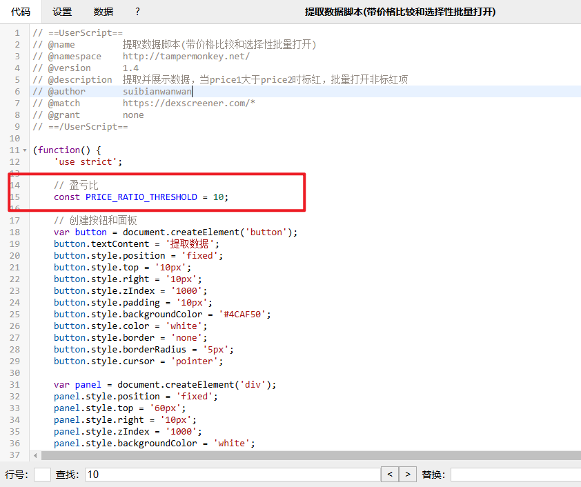

## 抓取聪明钱小工具

引流

- [推特](https://x.com/bbbaaahhh200)
- [chain.fm 频道](https://chain.fm/channel/1305381392003109041)

# 请在使用前使用 gpt 或者 懂代码 的情况下，检查脚本是否有恶意，小心我把你钱给拿走了

## 暴力猴脚本使用教程
1. [安装暴力猴](https://chromewebstore.google.com/detail/%E6%9A%B4%E5%8A%9B%E7%8C%B4/jinjaccalgkegednnccohejagnlnfdag)
2. 点击新增脚本

3. 将本项目的 main.js 的内容全部粘贴到新增脚本页面，记得要覆盖掉他原有的，不是追加，而是全部替换到我们的脚本
4. 保存
5. 当你到 dexscreen 页面中，确保你的脚本已经打开

## 脚本使用教程

1. 先点击 Top Traders
2. 点击按钮 [提取数据]
3. 点击分析，即可跳转到 gmgn 的地址详细页面
4. [批量分析] 按钮暂时有点问题，使用频率低，暂时没修

## 修改参数

目前固定的逻辑是不显示***无买入***的，因为意义不大

而可以修改的参数为***盈亏比***，默认值为10，只有大于这个盈亏比的才会显示绿色

